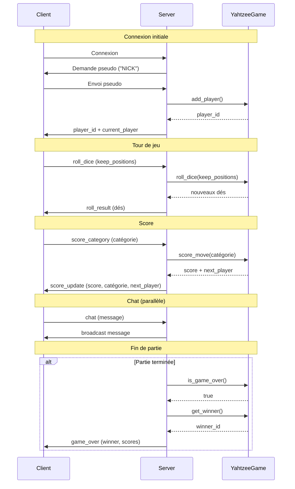

Programmation socket. Possibilité de chat entre les joueurs

```mermaid
sequenceDiagram
    participant C as Client
    participant S as Server
    participant G as YahtzeeGame

    Note over C,G: Connexion initiale
    C->>S: Connexion
    S->>C: Demande pseudo ("NICK")
    C->>S: Envoi pseudo
    S->>G: add_player()
    G-->>S: player_id
    S->>C: player_id + current_player

    Note over C,G: Tour de jeu
    C->>S: roll_dice (keep_positions)
    S->>G: roll_dice(keep_positions)
    G-->>S: nouveaux dés
    S->>C: roll_result (dés)

    Note over C,G: Score
    C->>S: score_category (catégorie)
    S->>G: score_move(catégorie)
    G-->>S: score + next_player
    S->>C: score_update (score, catégorie, next_player)

    Note over C,G: Chat (parallèle)
    C->>S: chat (message)
    S->>C: broadcast message

    Note over C,G: Fin de partie
    alt Partie terminée
        S->>G: is_game_over()
        G-->>S: true
        S->>G: get_winner()
        G-->>S: winner_id
        S->>C: game_over (winner, scores)
    end

```
